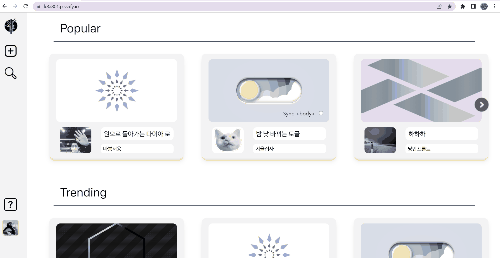

# README

# 🎍 CODE BAMBOO

---

## 💡 Code Bamboo **소개**

- 프런트엔드 코드 커뮤니티에서 자유롭게 질문하고 답변하며 유저들의 코드를 감상해요
- Code Mirror를 기반으로 하는 간편한 코드 에디터와 실시간 랜더링을 제공해요
- 여러 유저의 아이디어가 누적되며 답변의 퀄리티가 상승해요

## 🎬 Code Bamboo **시연 영상**

https://youtu.be/C7BFGnSYkW8

## 📅 **프로젝트 진행 기간**

**2023/4/10(월) ~ 2023/5/26(금)**
SSAFY 8기 2학기 자율프로젝트

## 💻 Code Bamboo **서비스 화면**

### **메인 페이지**

### CodeBamboo 소개 페이지

### **로그인 페이지**

### 토픽 생성, ChatGPT

### 로그 트리

### 추천, 북마크

### 검색페이지

### 귀여운 로딩창

## 🏗️ **아키텍처**

## 🗃️ **ERD**

## 🛠️ **기술 스택**

### **Frontend**

### **Backend**

### **CICD**

### **협업 툴**

## 📚 **프로젝트 산출물**

## 👥 **팀원 역할 분배**

---

### **Full Stack**

- 권태형 - FE(Intro, Main, Info), BE(user), 중간발표
- 신동찬 - FE(oauth, Profile), BE(auth, gcp, gpt)
- 윤서용 - 팀장, FE(editor, leaf)
- 지원석 - BE(Topic, leaf), FE(search), 최종발표

### Infra

- 남이랑 - CICD, 서버

## 🐼 개발 후기

---

- 권태형 - 프론트엔드의 새로운 기술 스택들 뿐만 아니라 JS 프레임워크를 이용한 백엔드 개발까지 다양한 경험을 할 수 있어서 보람찼습니다 !
- 신동찬 -  백엔드 뿐만 아니라, 그동안 써보고 싶었던 기술 스택들을 원없이 사용해봐서 싸피에서 마지막 프로젝트를 후회없이 마무리지었습니다. 개발 과정에서 여러가지 도전이 많았는데, 좋은 팀원들과 함께해서 마무리까지 잘 할 수 있게 된 것 같습니다.
- 윤서용 - 흥미로운 주제와 다양한 기술 스택을 모두 경험해볼 수 있는 좋은 기회였고 이번 프로젝트를 통해 더 성장한 것 같아 기쁩니다. 마음이 맞는 팀원들을 만나 행운이었습니다.
- 지원석 - JS 백엔드를 할 줄을 몰랐는데 정말 좋은 경험이었고 다른 새로운 기술 스택들을 사용해보는 것도 좋았습니다. 프로젝트 이후에도 리팩토링하면서 새로운 기술 스택을 공부하고 싶습니다.
- 남이랑 - 그동안 서버에 대해서는 경험이 적었는데, 많이 배울 수 있었습니다. 좋은 팀원들과 재밌는 주제로 프로젝트 하게 되어 행복했습니다!